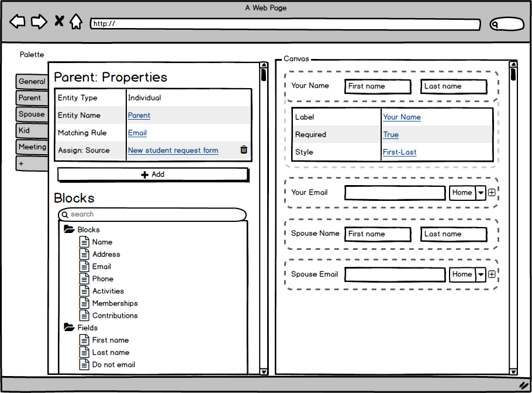

# org.civicrm.afform (Early Proof of Concept)

> You are looking at the `master` branch of a proof-of-concept module.  It
> may change radically (without full curation of docs, etc).  For previous
> iterations with more stable/cogent materials, check other branches (e.g.
> `0.1`).



The Affable Administrative Angular Form Framework (`afform`) is a system for administering AngularJS-based forms
in CiviCRM which:

1. Allows developers to declaratively define a canonical, baseline form using AngularJS.
2. Allows administrators (or administrative GUI tools) to use the CRUD API to customize the forms.
3. Allows developers (or administrators/tools) to embed these forms in other CiviCRM-AngularJS apps.
4. Allows developers to apply change-sets via hook. (*WIP; pending upstream support*)

This extension is a proof-of-concept.  It aims to demonstrate the core model/concept -- however, there are 
[known issues and additional components](docs/roadmap.md) to address, and some documentation will be easier to approach
if you already have a basic understanding of CiviCRM API and AngularJS.  It is licensed under [AGPL-3.0](LICENSE.txt).

## Requirements

* PHP v7.0+
* CiviCRM v5.22+

<!--
## Installation (Web UI)

This extension has not yet been published for installation via the web UI.

## Installation (CLI, Zip)

Sysadmins and developers may download the `.zip` file for this extension and
install it with the command-line tool [cv](https://github.com/civicrm/cv).

```bash
cd <extension-dir>
cv dl org.civicrm.afform@https://github.com/totten/afform/archive/master.zip
```
-->

## Installation (CLI, Git)

Sysadmins and developers may clone the [Git](https://en.wikipedia.org/wiki/Git) repo for this extension and
install it with the command-line tool [cv](https://github.com/civicrm/cv).

```bash
git clone https://lab.civicrm.org/extensions/afform.git
cv en afform
```

## Developer Documentation

* [Quick Start: Creating the canonical definition of a basic form](docs/quickstart.md)
* [Writing Forms: Afform as basic AngularJS templates](docs/writing.md) (With example: *Contact Record*)
* [Embedding Forms: Afform as reusable building-block](docs/embed.md) (With example: *Contact Record*)
* [Form CRUD: Updating forms via programmatic API](docs/crud.md)
* [Form Hooks: Updating forms via declarative selector](docs/alter.md) (*WIP; pending upstream support*)
* [Full AngularJS: Integrating between Afform and vanilla AngularJS](docs/angular.md)
* [Roadmap and Known Issues](docs/roadmap.md)
* [Philosophy, Beliefs, Assumptions](docs/philosophy.md)
