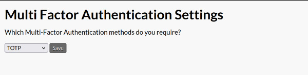
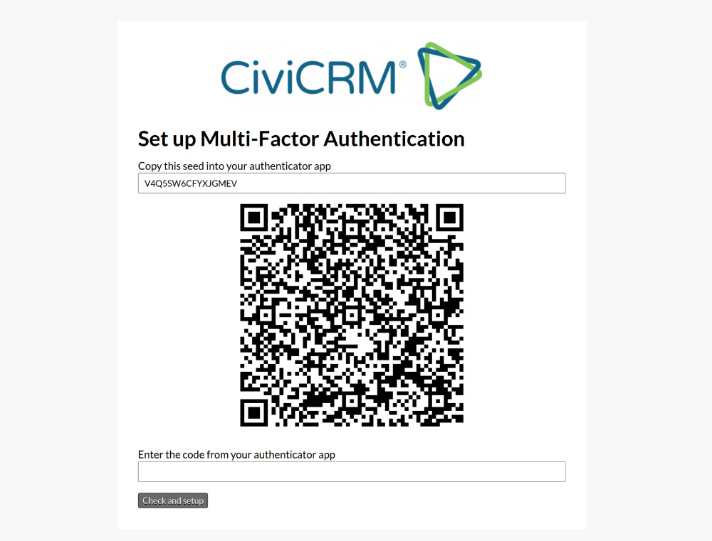
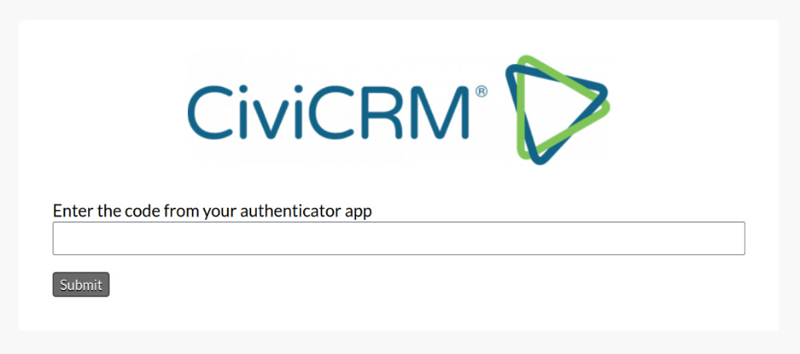

# Standalone Multi-Factor Authentication (MFA)

MFA improves security beyond a username and password combination, typically by requiring that users *have* something (an authenticator app), not just that they *know* something (their password). This means that if a password is stolen an attacker also needs to steal access to the configured authenticator app, too.

Standalone ships with support for time-based one-time password (TOTP), which is a common [internet standard](https://www.rfc-editor.org/rfc/rfc6238) method. It requires users initially to set up their authenticator app with a secret code provided by CiviCRM. Then at future logins the authenticator app will provide a 6 digit numeric code that must be entered. This code changes every 30 seconds.

## Administrators

To enable TOTP visit **Administration » Users and Permissions » Multi-Factor Authentication**
and select *TOTP* instead of *Disabled*

## Users: initial set-up

If you have not set up TOTP yet and the administrator has set it to be required, you will be required to set it up on your next login. After entering your password you will see a screen like this:

The process will be different depending on what authenticator app and device you choose to use. Typically, if you have an authenticator app on your phone you are able to scan the QR code and then your app will show you the 6 digit code.

Once you correctly enter a code, it saves it to your record and you will need to use that authenticator app each time you log in.

## Users: future logging in

Once you have set up TOTP you are required to enter the code from your app with each login.

## What if you lost access to your authenticator app?

You will not be able to log in, and will need someone with admin permissions and access to the API to remove your TOTP record, which will then force you to re-set up TOTP on your next login.

## Finding an authenticator app

Support for TOTP can be found in dedicated apps and also bundled with various security apps. It is sometimes known by OTP, TFA, 2FA, authenticator, RFC-6238.
